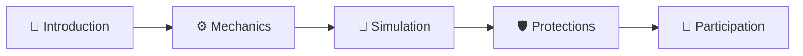

# 🌍 HISA Liquidity Pool Explainer

> **Interactive Educational App for Web2 to Web3 Onboarding**

An interactive Jupyter Notebook application that helps onboard Web2 users to Web3 concepts by explaining DeFi liquidity pools and impermanent loss, with a focus on how HISA token minimizes these risks.

---

## 🎯 Overview

This educational tool bridges the gap between traditional finance and decentralized finance (DeFi) through:

- **5 comprehensive educational slides** covering DeFi fundamentals
- **Interactive impermanent loss simulation** with real-time visualizations
- **Visual explanations** of complex blockchain concepts
- **HISA-specific protection mechanisms** details
- **Practical guidance** for getting started in DeFi

---

## ✨ Key Features

### 📚 1. Comprehensive Educational Slides

| Slide | Topic | Description |
|-------|-------|-------------|
| 1 | Introduction to DeFi | Basic concepts and liquidity pools |
| 2 | Pool Mechanics | Constant product formula explained |
| 3 | Risk Simulation | Interactive impermanent loss calculator |
| 4 | HISA Protections | Unique risk mitigation strategies |
| 5 | Getting Started | Practical participation guide |

### 🎮 2. Interactive Impermanent Loss Simulator

- **🎚️ Adjustable slider** to change token prices
- **📊 Real-time visualization** of pool composition
- **💰 Value comparison** between holding vs providing liquidity
- **📖 Educational explanations** of impermanent loss concepts

### 🛡️ 3. HISA-Specific Protections

- **⚡ Dynamic fee adjustments** during market volatility
- **🔗 USDC-pegged stabilization** mechanisms
- **📈 Volatility-triggered** protection systems
- **🏦 Multi-token reserve** system architecture

### 🌐 4. Web2 to Web3 Onboarding

- **💬 Simple language** avoiding technical jargon
- **🎨 Visual explanations** of complex concepts
- **🔄 Clear comparisons** between traditional vs DeFi approaches
- **🚀 Practical participation** guidance

---

## 🚀 Quick Start

### Prerequisites

- **Python 3.7+**
- **Jupyter Notebook** or **Jupyter Lab**
- **Git** (for cloning)

### Installation

1. **Clone the repository:**
   ```bash
   git clone https://github.com/yourusername/hisa-liquidity-explainer.git
   cd hisa-liquidity-explainer
   ```

2. **Create and activate virtual environment:**
   ```bash
   # Create virtual environment
   python -m venv venv
   
   # Activate (Linux/Mac)
   source venv/bin/activate
   
   # Activate (Windows)
   venv\Scripts\activate
   ```

3. **Install dependencies:**
   ```bash
   pip install ipywidgets matplotlib numpy
   ```

4. **Launch Jupyter:**
   ```bash
   jupyter notebook
   ```

5. **Open and run:**
   - Open `HISA_Liquidity_Explainer.ipynb`
   - Run all cells to start the interactive application

---

## 📱 Application Structure

### Core Components

```
HISA Liquidity Explainer/
├── 🧭 Navigation System
│   ├── Previous/Next buttons
│   └── Progress indicators
├── 📖 Educational Slides
│   ├── Slide 1: Welcome to DeFi Liquidity Pools
│   ├── Slide 2: How Liquidity Pools Work
│   ├── Slide 3: Impermanent Loss Simulator
│   ├── Slide 4: HISA Protection Mechanisms
│   └── Slide 5: Getting Started with HISA Ecosystem
└── 🎮 Interactive Components
    ├── Price adjustment slider
    ├── Real-time pool visualization
    ├── Value comparison charts
    └── Educational tooltips
```

### Technical Stack

| Component | Technology | Purpose |
|-----------|------------|---------|
| **Frontend** | Jupyter Widgets | Interactive UI elements |
| **Visualization** | Matplotlib | Charts and graphs |
| **Calculations** | NumPy | Mathematical operations |
| **Backend** | Python 3.7+ | Core application logic |

---

## 🎓 Educational Journey

### Learning Path



1. **🌟 Introduction** - Learn about DeFi liquidity pools and HISA's approach
2. **⚙️ Mechanics** - Understand how constant product AMMs work
3. **🧪 Simulation** - Experiment with price changes and see their impact
4. **🛡️ Protections** - Discover how HISA minimizes impermanent loss risks
5. **🚀 Participation** - Get practical guidance on joining the ecosystem

---

## 🎯 Why This Matters

This application addresses critical challenges in DeFi adoption:

| Challenge | Solution |
|-----------|----------|
| **Complex Concepts** | 📚 Simplified explanations with visual aids |
| **Risk Understanding** | 🎮 Interactive simulation of real scenarios |
| **Technical Barriers** | 🌐 Web2-friendly interface and language |
| **Impermanent Loss** | 🛡️ HISA's innovative protection mechanisms |

### Impact Areas

- **🎓 Education** - Making DeFi concepts accessible to newcomers
- **💡 Innovation** - Demonstrating real economic impacts through simulation
- **🛡️ Risk Management** - Showcasing HISA's approach to solving DeFi challenges
- **🌍 Adoption** - Providing foundation for understanding blockchain applications

---

## 🤝 Contributing

We welcome contributions! Here's how to get started:

### Contribution Process

1. **🍴 Fork** the repository
2. **🌿 Create** a new branch for your feature
   ```bash
   git checkout -b feature/amazing-feature
   ```
3. **💻 Implement** your changes
4. **🧪 Test** your implementation
5. **📤 Submit** a pull request with clear description

### Guidelines

- ✅ Follow **PEP8** style guidelines
- 📝 Include **appropriate documentation**
- 🎨 Maintain **consistent visual styling**
- 🧪 Add **tests** for new features
- 📖 Update **README** if needed

---

## 📄 License

This project is licensed under the **MIT License** - see the [LICENSE](LICENSE) file for details.

---

## 🌍 About HISA

HISA is building Africa's resilient digital economy through:

- **🌱 Environmental Conservation** - Incentivizing sustainable practices
- **🎭 Cultural Preservation** - Protecting heritage through blockchain
- **💰 Financial Inclusion** - Democratizing access to financial services
- **📊 Stable Value** - Preserving purchasing power

### Community

- **👥 Users:** 50,000+ building a sustainable future
- **🌐 Website:** [HISA Official Website](https://hisa.website)
- **💬 Community:** Join our growing ecosystem

---

## 🚀 Get Started Now

Ready to understand DeFi liquidity pools and discover how HISA is revolutionizing blockchain economics?

**[🎯 Launch the Application](#quick-start) | [📖 Read the Docs](#educational-journey) | [🤝 Contribute](#contributing)**

---

<div align="center">

**Built with ❤️ for the future of decentralized finance**

*Making DeFi accessible to everyone, everywhere* 🌍🚀

</div>